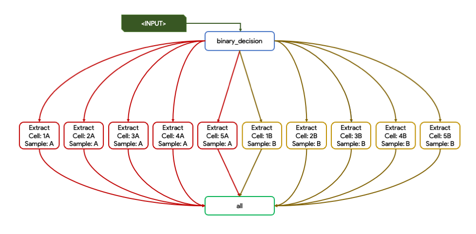
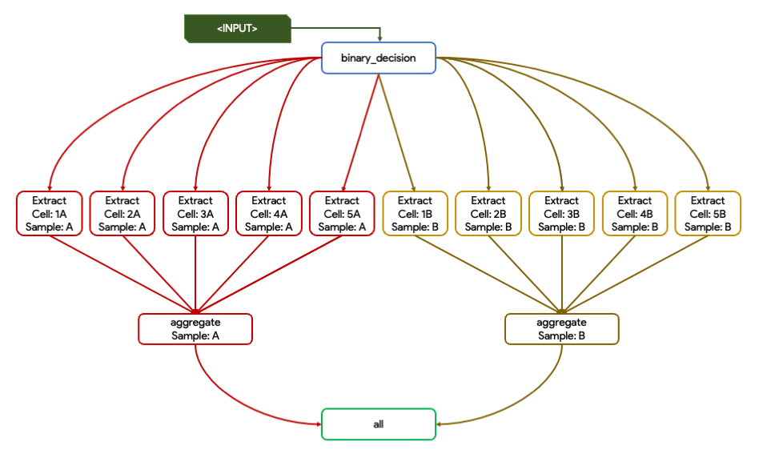
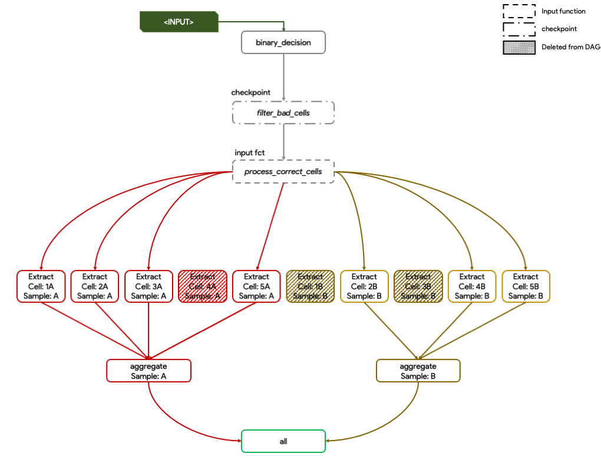
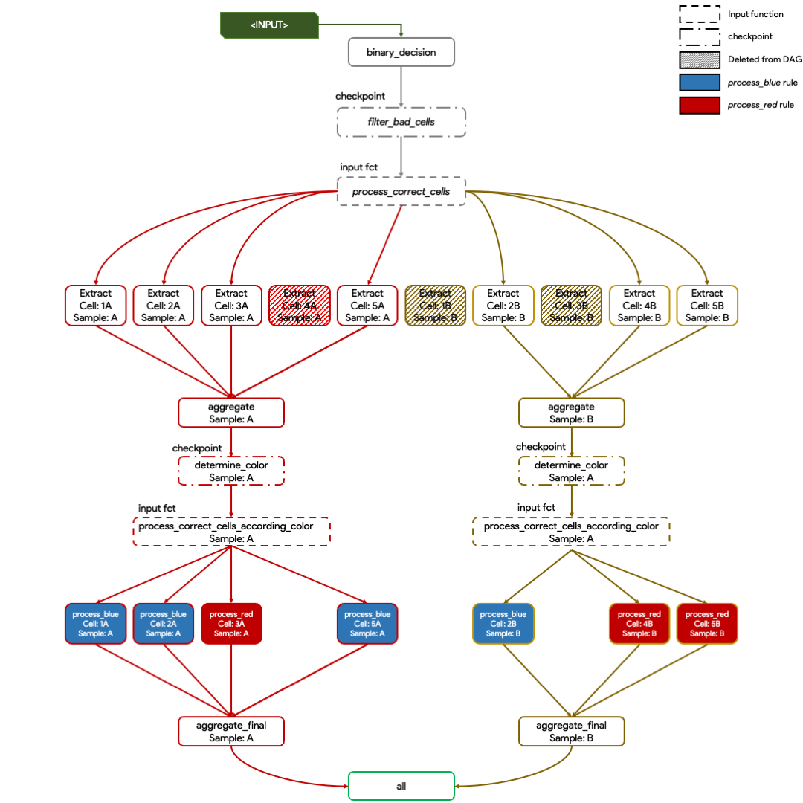

# Data-dependent conditional execution with Snakemake

|                                                          |
| :-------------------------------------------------------------------------------: |
|                        _Los Angeles highways aerial view_                         |
| _https://i0.wp.com/s26162.pcdn.co/wp-content/uploads/2022/07/highways.jpeg?ssl=1_ |

## Introduction

Dealing with pipeline developement usually implies to think about both the normal and expected execution, but also to specific use-cases to handle or data-dependent conditions, sometimes difficult to determine before running the workflow.

In this tutorial, we will use [**checkpoint** rules](https://snakemake.readthedocs.io/en/stable/snakefiles/rules.html#data-dependent-conditional-execution) to handle these behaviors. Snakemake **checkpoints** allow a "conditional reevaluation of the DAG of jobs based on the content outputs is possible".

## 0. Data & Dependencies preparation

Before diving into the snakepool, we will first create a directory dedicated to this tutorial.

```bash
mkdir snakemake_checkpoints && cd snakemake_checkpoints
mkdir data
touch Snakefile
```

If you do not have snakemake already installed, you can create and activate a conda environment with the following:

```bash
conda create -n snakemake_tutorial -c bioconda 'snakemake=7.9.0'
conda activate snakemake_tutorial
```

Then, we will generate a simple table dataset, imitating a single-cell omics dataset, that will be used for the rest of the pipeline as an input with the following:

```bash
echo "sample,cell,probability,ratio
A,1A,0.873,1.54
A,2A,0.679,2.12
A,3A,0.746,13.74
A,4A,0.281,1.13
A,5A,0.732,1.38
B,1B,0.123,1.91
B,2B,0.912,0.99
B,3B,0.373,1.52
B,4B,0.648,10.14
B,5B,0.976,12.08" > data/raw.tsv
```

The table created looks like the following:

| sample | cell | probability | ratio |
| ------ | ---- | ----------- | ----- |
| A      | 1A   | 0.873       | 1.54  |
| A      | 2A   | 0.679       | 2.12  |
| A      | 3A   | 0.746       | 13.74 |
| A      | 4A   | 0.281       | 1.13  |
| A      | 5A   | 0.732       | 1.38  |
| B      | 1B   | 0.123       | 1.91  |
| B      | 2B   | 0.912       | 0.99  |
| B      | 3B   | 0.373       | 1.52  |
| B      | 4B   | 0.648       | 10.14 |
| B      | 5B   | 0.976       | 12.08 |

Two samples (A and B) and the different cells associated (1[A|B] to 5[A|B]) are representend. Each cell has a putative probability and ratio used as metrics into this example.

## 1. Initial run

# A. Extract info at the cell level from processed table

Please paste the following into the `Snakefile` file.

```python
## Snakefile v1

# Import pandas library to process dataframes
import pandas as pd

# Dictionnary to retrieve cell list for each sample
sample_cell_dict = {
    "A": ["1A", "2A", "3A", "4A", "5A"],
    "B": ["1B", "2B", "3B", "4B", "5B"],
}
# List of samples to process
samples = list(sample_cell_dict.keys())


list_all = list()
# Iterate over sample and cell for each of the sample in order to build a final list of targets
for sample in samples:
    for cell in sample_cell_dict[sample]:
        list_all.append(
            "output/{sample}/extract/{cell}.txt".format(sample=sample, cell=cell)
        )
print(list_all)


# Snakemake backwards behavior (rule all = final target)
rule all:
    input:
        list_all

# Create a new file with an additional column keep (x>0.5 = True ; x<=0.5 = False)
rule binary_decision:
    input:
        file="data/raw.tsv",
    output:
        file="output/bin_col.tsv",
    run:
        df = pd.read_csv(input.file, sep=",")
        df["keep"] = df["probability"].apply(lambda r: True if r > 0.5 else False)
        df.to_csv(output.file, sep=",", index=False)


# Extract specific line corresponding to cell into a new file (named regarding cell)
rule extract:
    input:
        "output/bin_col.tsv",
    output:
        "output/{sample}/extract/{cell}.txt",
    shell:
        """
        head -n 1 {input} > {output}
        grep -P '{wildcards.cell}' {input} >> {output}
        """
```

In this first snakemake pipeline, two rules (and the classic target `rule all`) were created. The `rule binary_decision` corresponds to a first processing on the dataframe that will results in the creation of a new column `keep`, respecting the following behavior (x>0.5 = True ; x<=0.5 = False).
The `rule extract` corresponds to the creation of a specific file for each different cell by keeping the table header and the corresponding line of the cell.

Here, the `rule all` takes as an input all the final targets of the rule target, so a list of 10 different file paths, each corresponding to a single-cell.

Let's now perform a **dry-run** to check if eveything is looking well connected with the following:

```bash
snakemake --cores 1 --dry-run
```

You should obtain the following result:

```bash
['output/A/extract/1A.txt', 'output/A/extract/2A.txt', 'output/A/extract/3A.txt', 'output/A/extract/4A.txt', 'output/A/extract/5A.txt', 'output/B/extract/1B.txt', 'output/B/extract/2B.txt', 'output/B/extract/3B.txt', 'output/B/extract/4B.txt', 'output/B/extract/5B.txt']
Building DAG of jobs...
Job counts:
        count   jobs
        1       all
        1       binary_decision
        10      extract
        12

[Thu Aug  4 17:39:49 2022]
rule binary_decision:
    input: data/raw.tsv
    output: output/bin_col.tsv
    jobid: 11

[Thu Aug  4 17:39:49 2022]
rule extract:
    input: output/bin_col.tsv
    output: output/A/extract/1A.txt
    jobid: 1
    wildcards: sample=A, cell=1A


[Thu Aug  4 17:39:49 2022]
rule extract:
    input: output/bin_col.tsv
    output: output/A/extract/3A.txt
    jobid: 3
    wildcards: sample=A, cell=3A


[Thu Aug  4 17:39:49 2022]
rule extract:
    input: output/bin_col.tsv
    output: output/A/extract/4A.txt
    jobid: 4
    wildcards: sample=A, cell=4A


[Thu Aug  4 17:39:49 2022]
rule extract:
    input: output/bin_col.tsv
    output: output/B/extract/1B.txt
    jobid: 6
    wildcards: sample=B, cell=1B


[Thu Aug  4 17:39:49 2022]
rule extract:
    input: output/bin_col.tsv
    output: output/B/extract/3B.txt
    jobid: 8
    wildcards: sample=B, cell=3B


[Thu Aug  4 17:39:49 2022]
rule extract:
    input: output/bin_col.tsv
    output: output/B/extract/5B.txt
    jobid: 10
    wildcards: sample=B, cell=5B


[Thu Aug  4 17:39:49 2022]
rule extract:
    input: output/bin_col.tsv
    output: output/A/extract/2A.txt
    jobid: 2
    wildcards: sample=A, cell=2A


[Thu Aug  4 17:39:49 2022]
rule extract:
    input: output/bin_col.tsv
    output: output/A/extract/5A.txt
    jobid: 5
    wildcards: sample=A, cell=5A


[Thu Aug  4 17:39:49 2022]
rule extract:
    input: output/bin_col.tsv
    output: output/B/extract/2B.txt
    jobid: 7
    wildcards: sample=B, cell=2B


[Thu Aug  4 17:39:49 2022]
rule extract:
    input: output/bin_col.tsv
    output: output/B/extract/4B.txt
    jobid: 9
    wildcards: sample=B, cell=4B


[Thu Aug  4 17:39:49 2022]
localrule all:
    input: output/A/extract/1A.txt, output/A/extract/2A.txt, output/A/extract/3A.txt, output/A/extract/4A.txt, output/A/extract/5A.txt, output/B/extract/1B.txt, output/B/extract/2B.txt, output/B/extract/3B.txt, output/B/extract/4B.txt, output/B/extract/5B.txt
    jobid: 0

Job counts:
        count   jobs
        1       all
        1       binary_decision
        10      extract
        12
This was a dry-run (flag -n). The order of jobs does not reflect the order of execution.
```

Let's now run concretely the snakemake:

```bash
snakemake --cores 1
```

that produces the following output:

```bash
Building DAG of jobs...
Using shell: /usr/bin/bash
Provided cores: 1 (use --cores to define parallelism)
Rules claiming more threads will be scaled down.
Job counts:
        count   jobs
        1       all
        1       binary_decision
        10      extract
        12

[Thu Aug  4 23:39:42 2022]
rule binary_decision:
    input: data/raw.tsv
    output: output/bin_col.tsv
    jobid: 11

Job counts:
        count   jobs
        1       binary_decision
        1
[Thu Aug  4 23:39:43 2022]
Finished job 11.
1 of 12 steps (8%) done

[Thu Aug  4 23:39:44 2022]
rule extract:
    input: output/bin_col.tsv
    output: output/B/extract/4B.txt
    jobid: 9
    wildcards: sample=B, cell=4B

[Thu Aug  4 23:39:44 2022]
Finished job 9.
2 of 12 steps (17%) done

[Thu Aug  4 23:39:44 2022]
rule extract:
    input: output/bin_col.tsv
    output: output/B/extract/2B.txt
    jobid: 7
    wildcards: sample=B, cell=2B

[Thu Aug  4 23:39:44 2022]
Finished job 7.
3 of 12 steps (25%) done

[Thu Aug  4 23:39:44 2022]
rule extract:
    input: output/bin_col.tsv
    output: output/A/extract/5A.txt
    jobid: 5
    wildcards: sample=A, cell=5A

[Thu Aug  4 23:39:44 2022]
Finished job 5.
4 of 12 steps (33%) done

[Thu Aug  4 23:39:44 2022]
rule extract:
    input: output/bin_col.tsv
    output: output/A/extract/2A.txt
    jobid: 2
    wildcards: sample=A, cell=2A

[Thu Aug  4 23:39:44 2022]
Finished job 2.
5 of 12 steps (42%) done

[Thu Aug  4 23:39:44 2022]
rule extract:
    input: output/bin_col.tsv
    output: output/B/extract/5B.txt
    jobid: 10
    wildcards: sample=B, cell=5B

[Thu Aug  4 23:39:44 2022]
Finished job 10.
6 of 12 steps (50%) done

[Thu Aug  4 23:39:44 2022]
rule extract:
    input: output/bin_col.tsv
    output: output/B/extract/3B.txt
    jobid: 8
    wildcards: sample=B, cell=3B

[Thu Aug  4 23:39:44 2022]
Finished job 8.
7 of 12 steps (58%) done

[Thu Aug  4 23:39:44 2022]
rule extract:
    input: output/bin_col.tsv
    output: output/B/extract/1B.txt
    jobid: 6
    wildcards: sample=B, cell=1B

[Thu Aug  4 23:39:44 2022]
Finished job 6.
8 of 12 steps (67%) done

[Thu Aug  4 23:39:44 2022]
rule extract:
    input: output/bin_col.tsv
    output: output/A/extract/4A.txt
    jobid: 4
    wildcards: sample=A, cell=4A

[Thu Aug  4 23:39:44 2022]
Finished job 4.
9 of 12 steps (75%) done

[Thu Aug  4 23:39:44 2022]
rule extract:
    input: output/bin_col.tsv
    output: output/A/extract/1A.txt
    jobid: 1
    wildcards: sample=A, cell=1A

[Thu Aug  4 23:39:44 2022]
Finished job 1.
10 of 12 steps (83%) done

[Thu Aug  4 23:39:45 2022]
rule extract:
    input: output/bin_col.tsv
    output: output/A/extract/3A.txt
    jobid: 3
    wildcards: sample=A, cell=3A

[Thu Aug  4 23:39:45 2022]
Finished job 3.
11 of 12 steps (92%) done

[Thu Aug  4 23:39:45 2022]
localrule all:
    input: output/A/extract/1A.txt, output/A/extract/2A.txt, output/A/extract/3A.txt, output/A/extract/4A.txt, output/A/extract/5A.txt, output/B/extract/1B.txt, output/B/extract/2B.txt, output/B/extract/3B.txt, output/B/extract/4B.txt, output/B/extract/5B.txt
    jobid: 0

[Thu Aug  4 23:39:45 2022]
Finished job 0.
12 of 12 steps (100%) done
```

Let's now check the content of the outputs.

```bash
tree -h output/
```

```bash
output
|-- [4.0K]  A
|   `-- [4.0K]  extract
|       |-- [  56]  1A.txt
|       |-- [  56]  2A.txt
|       |-- [  57]  3A.txt
|       |-- [  57]  4A.txt
|       `-- [  56]  5A.txt
|-- [4.0K]  B
|   `-- [4.0K]  extract
|       |-- [  71]  1B.txt
|       |-- [  56]  2B.txt
|       |-- [  57]  3B.txt
|       |-- [  57]  4B.txt
|       `-- [  57]  5B.txt
`-- [ 265]  bin_col.tsv

4 directories, 11 files
```

```bash
cat "output/bin_col.tsv"
```

| sample | cell | probability | ratio | keep  |
| ------ | ---- | ----------- | ----- | ----- |
| A      | 1A   | 0.873       | 1.54  | True  |
| A      | 2A   | 0.679       | 2.12  | True  |
| A      | 3A   | 0.746       | 13.74 | True  |
| A      | 4A   | 0.281       | 1.13  | False |
| A      | 5A   | 0.732       | 1.38  | True  |
| B      | 1B   | 0.123       | 1.91  | False |
| B      | 2B   | 0.912       | 0.99  | True  |
| B      | 3B   | 0.373       | 1.52  | False |
| B      | 4B   | 0.648       | 10.14 | True  |
| B      | 5B   | 0.976       | 12.08 | True  |

We can see that a new column `keep` was created, filled with a boolean based on the `probability` (cutoff=0.5) column.

```bash
cat "output/A/extract/1A.txt"
```

| sample | cell | probability | ratio | keep |
| ------ | ---- | ----------- | ----- | ---- |
| A      | 1A   | 0.873       | 1.54  | True |

The files at the cell-level were also properly created, keeping only the information relative to each single-cell.

### Snakemake Directed acyclic graph (DAG) summary

|               |
| :---------------------------------: |
| _Step 1A. Graphical representation_ |

# B. Aggregate data into a rule

As you surely noticed, it may not be handy to first generate a list of inputs like the way we did. We will here add a new `rule aggregate` that will leverages the python `expand` statement to automatically retrieve input targets and concatenate previous single-cell file at the sample level. Thus, the modified `rule all` now only needs to take two elements corresponding at the two samples processed.

```python
## Snakefile v1.1

# Import pandas library to process dataframes
import pandas as pd

# Dictionnary to retrieve cell list for each sample
sample_cell_dict = {
    "A": ["1A", "2A", "3A", "4A", "5A"],
    "B": ["1B", "2B", "3B", "4B", "5B"],
}
# List of samples to process
samples = list(sample_cell_dict.keys())

# Snakemake backwards behavior (rule all = aggregate_final target)
rule all:
    input:
        #========MODIFIED========#
        ["output/agg/A.out", "output/agg/B.out"],

# Create a new file with an additional column keep (x>0.5 = True ; x<=0.5 = False)
rule binary_decision:
    input:
        file="data/raw.tsv",
    output:
        file="output/bin_col.tsv",
    run:
        df = pd.read_csv(input.file, sep=",")
        df["keep"] = df["probability"].apply(lambda r: True if r > 0.5 else False)
        df.to_csv(output.file, sep=",", index=False)


# Extract specific line corresponding to cell into a new file (named regarding cell)
rule extract:
    input:
        "output/bin_col.tsv",
    output:
        "output/{sample}/extract/{cell}.txt",
    shell:
        """
        head -n 1 {input} > {output}
        grep -P '{wildcards.cell}' {input} >> {output}
        """


#========ADDITION========#
rule aggregate:
    input:
        # Use expand function to compute list of targets
        [expand("output/{sample}/extract/{cell}.txt", sample=sample, cell=sample_cell_dict[sample]) for sample in samples]
    output:
        "output/agg/{sample}.out",
    shell:
        """
        head -n1 {input[0]} > {output}
        tail -q -n +2 {input} | grep {wildcards.sample} >> {output}
        """
```

Like previously, let's first check with the `--dry-run` option

```bash
snakemake --cores 1 --dry-run --forceall
```

Expected output:

```bash
Building DAG of jobs...
Job counts:
        count   jobs
        2       aggregate
        1       all
        1       binary_decision
        10      extract
        14

[Thu Aug  4 17:48:46 2022]
rule binary_decision:
    input: data/raw.tsv
    output: output/bin_col.tsv
    jobid: 13

[Thu Aug  4 17:48:46 2022]
rule extract:
    input: output/bin_col.tsv
    output: output/A/extract/1A.txt
    jobid: 3
    wildcards: sample=A, cell=1A


[Thu Aug  4 17:48:46 2022]
rule extract:
    input: output/bin_col.tsv
    output: output/A/extract/2A.txt
    jobid: 4
    wildcards: sample=A, cell=2A


[Thu Aug  4 17:48:46 2022]
rule extract:
    input: output/bin_col.tsv
    output: output/A/extract/4A.txt
    jobid: 6
    wildcards: sample=A, cell=4A


[Thu Aug  4 17:48:46 2022]
rule extract:
    input: output/bin_col.tsv
    output: output/B/extract/1B.txt
    jobid: 8
    wildcards: sample=B, cell=1B


[Thu Aug  4 17:48:46 2022]
rule extract:
    input: output/bin_col.tsv
    output: output/B/extract/3B.txt
    jobid: 10
    wildcards: sample=B, cell=3B


[Thu Aug  4 17:48:46 2022]
rule extract:
    input: output/bin_col.tsv
    output: output/B/extract/5B.txt
    jobid: 12
    wildcards: sample=B, cell=5B


[Thu Aug  4 17:48:46 2022]
rule extract:
    input: output/bin_col.tsv
    output: output/A/extract/3A.txt
    jobid: 5
    wildcards: sample=A, cell=3A


[Thu Aug  4 17:48:46 2022]
rule extract:
    input: output/bin_col.tsv
    output: output/A/extract/5A.txt
    jobid: 7
    wildcards: sample=A, cell=5A


[Thu Aug  4 17:48:46 2022]
rule extract:
    input: output/bin_col.tsv
    output: output/B/extract/2B.txt
    jobid: 9
    wildcards: sample=B, cell=2B


[Thu Aug  4 17:48:46 2022]
rule extract:
    input: output/bin_col.tsv
    output: output/B/extract/4B.txt
    jobid: 11
    wildcards: sample=B, cell=4B


[Thu Aug  4 17:48:46 2022]
rule aggregate:
    input: output/A/extract/1A.txt, output/A/extract/2A.txt, output/A/extract/3A.txt, output/A/extract/4A.txt, output/A/extract/5A.txt, output/B/extract/1B.txt, output/B/extract/2B.txt, output/B/extract/3B.txt, output/B/extract/4B.txt, output/B/extract/5B.txt
    output: output/agg/B.out
    jobid: 2
    wildcards: sample=B


[Thu Aug  4 17:48:46 2022]
rule aggregate:
    input: output/A/extract/1A.txt, output/A/extract/2A.txt, output/A/extract/3A.txt, output/A/extract/4A.txt, output/A/extract/5A.txt, output/B/extract/1B.txt, output/B/extract/2B.txt, output/B/extract/3B.txt, output/B/extract/4B.txt, output/B/extract/5B.txt
    output: output/agg/A.out
    jobid: 1
    wildcards: sample=A


[Thu Aug  4 17:48:46 2022]
localrule all:
    input: output/agg/A.out, output/agg/B.out
    jobid: 0

Job counts:
        count   jobs
        2       aggregate
        1       all
        1       binary_decision
        10      extract
        14
This was a dry-run (flag -n). The order of jobs does not reflect the order of execution.
```

And then by running concretely:

```bash
snakemake --cores 1 --forceall
```

Expected output:

```bash
Building DAG of jobs...
Using shell: /usr/bin/bash
Provided cores: 1 (use --cores to define parallelism)
Rules claiming more threads will be scaled down.
Job counts:
        count   jobs
        2       aggregate
        1       all
        1       binary_decision
        10      extract
        14

[Thu Aug  4 23:50:05 2022]
rule binary_decision:
    input: data/raw.tsv
    output: output/bin_col.tsv
    jobid: 13

Job counts:
        count   jobs
        1       binary_decision
        1
[Thu Aug  4 23:50:06 2022]
Finished job 13.
1 of 14 steps (7%) done

[Thu Aug  4 23:50:06 2022]
rule extract:
    input: output/bin_col.tsv
    output: output/B/extract/4B.txt
    jobid: 11
    wildcards: sample=B, cell=4B

[Thu Aug  4 23:50:06 2022]
Finished job 11.
2 of 14 steps (14%) done

[Thu Aug  4 23:50:06 2022]
rule extract:
    input: output/bin_col.tsv
    output: output/B/extract/2B.txt
    jobid: 9
    wildcards: sample=B, cell=2B

[Thu Aug  4 23:50:06 2022]
Finished job 9.
3 of 14 steps (21%) done

[Thu Aug  4 23:50:06 2022]
rule extract:
    input: output/bin_col.tsv
    output: output/A/extract/5A.txt
    jobid: 7
    wildcards: sample=A, cell=5A

[Thu Aug  4 23:50:06 2022]
Finished job 7.
4 of 14 steps (29%) done

[Thu Aug  4 23:50:06 2022]
rule extract:
    input: output/bin_col.tsv
    output: output/A/extract/3A.txt
    jobid: 5
    wildcards: sample=A, cell=3A

[Thu Aug  4 23:50:06 2022]
Finished job 5.
5 of 14 steps (36%) done

[Thu Aug  4 23:50:06 2022]
rule extract:
    input: output/bin_col.tsv
    output: output/B/extract/5B.txt
    jobid: 12
    wildcards: sample=B, cell=5B

[Thu Aug  4 23:50:06 2022]
Finished job 12.
6 of 14 steps (43%) done

[Thu Aug  4 23:50:07 2022]
rule extract:
    input: output/bin_col.tsv
    output: output/B/extract/3B.txt
    jobid: 10
    wildcards: sample=B, cell=3B

[Thu Aug  4 23:50:07 2022]
Finished job 10.
7 of 14 steps (50%) done

[Thu Aug  4 23:50:07 2022]
rule extract:
    input: output/bin_col.tsv
    output: output/B/extract/1B.txt
    jobid: 8
    wildcards: sample=B, cell=1B

[Thu Aug  4 23:50:07 2022]
Finished job 8.
8 of 14 steps (57%) done

[Thu Aug  4 23:50:07 2022]
rule extract:
    input: output/bin_col.tsv
    output: output/A/extract/4A.txt
    jobid: 6
    wildcards: sample=A, cell=4A

[Thu Aug  4 23:50:07 2022]
Finished job 6.
9 of 14 steps (64%) done

[Thu Aug  4 23:50:07 2022]
rule extract:
    input: output/bin_col.tsv
    output: output/A/extract/1A.txt
    jobid: 3
    wildcards: sample=A, cell=1A

[Thu Aug  4 23:50:07 2022]
Finished job 3.
10 of 14 steps (71%) done

[Thu Aug  4 23:50:07 2022]
rule extract:
    input: output/bin_col.tsv
    output: output/A/extract/2A.txt
    jobid: 4
    wildcards: sample=A, cell=2A

[Thu Aug  4 23:50:07 2022]
Finished job 4.
11 of 14 steps (79%) done

[Thu Aug  4 23:50:07 2022]
rule aggregate:
    input: output/A/extract/1A.txt, output/A/extract/2A.txt, output/A/extract/3A.txt, output/A/extract/4A.txt, output/A/extract/5A.txt, output/B/extract/1B.txt, output/B/extract/2B.txt, output/B/extract/3B.txt, output/B/extract/4B.txt, output/B/extract/5B.txt
    output: output/agg/B.out
    jobid: 2
    wildcards: sample=B

[Thu Aug  4 23:50:07 2022]
Finished job 2.
12 of 14 steps (86%) done

[Thu Aug  4 23:50:07 2022]
rule aggregate:
    input: output/A/extract/1A.txt, output/A/extract/2A.txt, output/A/extract/3A.txt, output/A/extract/4A.txt, output/A/extract/5A.txt, output/B/extract/1B.txt, output/B/extract/2B.txt, output/B/extract/3B.txt, output/B/extract/4B.txt, output/B/extract/5B.txt
    output: output/agg/A.out
    jobid: 1
    wildcards: sample=A

[Thu Aug  4 23:50:07 2022]
Finished job 1.
13 of 14 steps (93%) done

[Thu Aug  4 23:50:07 2022]
localrule all:
    input: output/agg/A.out, output/agg/B.out
    jobid: 0

[Thu Aug  4 23:50:07 2022]
Finished job 0.
14 of 14 steps (100%) done
```

Let's now check the content

```bash
cat output/agg/A.out
```

| sample | cell | probability | ratio | keep  |
| ------ | ---- | ----------- | ----- | ----- |
| A      | 1A   | 0.873       | 1.54  | True  |
| A      | 2A   | 0.679       | 2.12  | True  |
| A      | 3A   | 0.746       | 13.74 | True  |
| A      | 4A   | 0.281       | 1.13  | False |
| A      | 5A   | 0.732       | 1.38  | True  |

Tables produced are, as expected, at the sample level.

### Snakemake DAG summary

|               |
| :---------------------------------: |
| _Step 1B. Graphical representation_ |

## 2. First checkpoint: filtering low-quality cells

Okay, let's start now more concretely with the purpose of the tutorial. Here are some explanations about the concept of checkpoints and how to technically incorporate them into a snakemake pipeline.

A checkpoint rule differentiates itself by the use of the `checkpoint` statement instead of the `rule` one. This implies that after that specific rule, snakemake will need to dynamically recomputes the Directed Acyclic Graph (DAG) of execution.

```python
checkpoint filter_bad_cells:
    input:
        file
    output:
        file
    shell/run/script:
        SOME_COMMANDS
```

Instead of accessing the content of this special checkpoint rule by a new rule as we would do classicaly, we need here to define a python function (`def`) that will return a new list of targets. This function will parse the result of the checkpoint rule, allowing different conditional processing: filter out elements, conditionnaly redistribute to specific rules the elements.

```python
def process_correct_cells(wildcards):
    with open checkpoints.filter_bad_cells.get(sample=wildcards.sample).output.file as f:
        filtered_list = list()
        for line in f:
            filtered_list.append(line)
        return filtered_list
```

How to connect and gather everything? By using a last rule that will take directly the function as an input.

```python
rule aggregate:
    input:
        INPUT_FCT,
    output:
        file
    shell/run/script:
        SOME_COMMANDS
```

Let's now apply that to our pipeline.

First, the checkpoint will create a new dataframe that comprises only cells where the column `keep` corresponds to `True`.

```python
checkpoint filter_bad_cells:
    input:
        file="output/bin_col.tsv",
    output:
        file="output/filter.tsv",
    run:
        df = pd.read_csv(input.file, sep=",")
        df = df.loc[df["keep"] == True]
        df.to_csv(output.file, sep=",", index=False)
```

Then, through a python function, we will first access this dataframe through the syntax `checkpoints.rule_name.get(w=wildcards.w).output`, then processing the dataframe to create the list of cells we want to be processed. As the target rule is the `rule extract`, we will use the output syntax of this rule to create the final list of targets.

```python
def process_correct_cells(wildcards):
    df = pd.read_csv(
        checkpoints.filter_bad_cells.get(sample=wildcards.sample).output.file, sep=","
    )
    keep_dict = df[["sample", "cell"]].groupby("sample")["cell"].apply(list).to_dict()

    filtered_list = list()
    for sample in list(keep_dict.keys()):
        for cell in keep_dict[sample]:
            filtered_list.append(
                "output/{sample}/extract/{cell}.txt".format(sample=sample, cell=cell)
            )

    return filtered_list
```

Instead of using the previous input of the `rule aggregate` directly as the output of the `rule extract`, we will here give the function `process_correct_cells` as an input.

```python
rule aggregate:
    input:
        process_correct_cells,
    output:
        "output/agg/{sample}.out",
    shell:
        """
        head -n1 {input[0]} > {output}
        tail -q -n +2 {input} | grep {wildcards.sample} >> {output}
        """
```

You can modify directly your Snakefile with the following:

```python
## Snakefile v2

# Import pandas library to process dataframes
import pandas as pd

# Dictionnary to retrieve cell list for each sample
sample_cell_dict = {
    "A": ["1A", "2A", "3A", "4A", "5A"],
    "B": ["1B", "2B", "3B", "4B", "5B"],
}
# List of samples to process
samples = list(sample_cell_dict.keys())


rule all:
    input:
        ["output/agg/A.out", "output/agg/B.out"],


rule binary_decision:
    input:
        file="data/raw.tsv",
    output:
        file="output/bin_col.tsv",
    run:
        df = pd.read_csv(input.file, sep=",")
        df["keep"] = df["probability"].apply(lambda r: True if r > 0.5 else False)
        df.to_csv(output.file, sep=",", index=False)


rule extract:
    input:
        "output/bin_col.tsv",
    output:
        "output/{sample}/extract/{cell}.txt",
    shell:
        """
        head -n 1 {input} > {output}
        grep -P '{wildcards.cell}' {input} >> {output}
        """

checkpoint filter_bad_cells:
    input:
        file="output/bin_col.tsv",
    output:
        file="output/filter.tsv",
    run:
        df = pd.read_csv(input.file, sep=",")
        df = df.loc[df["keep"] == True]
        df.to_csv(output.file, sep=",", index=False)

def process_correct_cells(wildcards):
    df = pd.read_csv(
        checkpoints.filter_bad_cells.get(sample=wildcards.sample).output.file, sep=","
    )
    keep_dict = df[["sample", "cell"]].groupby("sample")["cell"].apply(list).to_dict()

    filtered_list = list()
    for sample in list(keep_dict.keys()):
        for cell in keep_dict[sample]:
            filtered_list.append(
                "output/{sample}/extract/{cell}.txt".format(sample=sample, cell=cell)
            )

    return filtered_list

rule aggregate:
    input:
        process_correct_cells,
    output:
        "output/agg/{sample}.out",
    shell:
        """
        head -n1 {input[0]} > {output}
        tail -q -n +2 {input} | grep {wildcards.sample} >> {output}
        """
```

In order to avoid snakemake to use any previously generated results, we will first delete the content of the `output` folder.

```bash
rm -rdf output/
```

As you are now used to, we will then first try the pipeline with a dry-run:

```bash
snakemake --cores 1 --dry-run --forceall
```

Expected output:

```
Building DAG of jobs...
Job counts:
        count   jobs
        2       aggregate
        1       all
        1       binary_decision
        1       filter_bad_cells
        5

[Thu Aug  4 17:58:10 2022]
rule binary_decision:
    input: data/raw.tsv
    output: output/bin_col.tsv
    jobid: 4

[Thu Aug  4 17:58:10 2022]
checkpoint filter_bad_cells:
    input: output/bin_col.tsv
    output: output/filter.tsv
    jobid: 3
Downstream jobs will be updated after completion.

[Thu Aug  4 17:58:10 2022]
rule aggregate:
    input: <TBD>
    output: output/agg/A.out
    jobid: 1
    wildcards: sample=A


[Thu Aug  4 17:58:10 2022]
rule aggregate:
    input: <TBD>
    output: output/agg/B.out
    jobid: 2
    wildcards: sample=B


[Thu Aug  4 17:58:10 2022]
localrule all:
    input: output/agg/A.out, output/agg/B.out
    jobid: 0

Job counts:
        count   jobs
        2       aggregate
        1       all
        1       binary_decision
        1       filter_bad_cells
        5
```

You may have noticed here that we now only have 5 jobs, so less than before. Indeed, if you are looking into the log, snakemake is precising that "_Downstream jobs will be updated after completion._" meaning that the DAG and then the number of jobs to be processed can be modified during the execution.

Let's check that with a real run:

```bash
snakemake --cores 1 --forceall
```

Expected output:

```bash
Building DAG of jobs...
Using shell: /usr/bin/bash
Provided cores: 1 (use --cores to define parallelism)
Rules claiming more threads will be scaled down.
Job counts:
        count   jobs
        2       aggregate
        1       all
        1       binary_decision
        1       filter_bad_cells
        5

[Thu Aug  4 18:07:27 2022]
rule binary_decision:
    input: data/raw.tsv
    output: output/bin_col.tsv
    jobid: 4

Job counts:
        count   jobs
        1       binary_decision
        1
[Thu Aug  4 18:07:28 2022]
Finished job 4.
1 of 5 steps (20%) done

[Thu Aug  4 18:07:28 2022]
checkpoint filter_bad_cells:
    input: output/bin_col.tsv
    output: output/filter.tsv
    jobid: 3
Downstream jobs will be updated after completion.

Job counts:
        count   jobs
        1       filter_bad_cells
        1
Updating job 1 (aggregate).
Updating job 2 (aggregate).
[Thu Aug  4 18:07:30 2022]
Finished job 3.
2 of 12 steps (17%) done

[Thu Aug  4 18:07:30 2022]
rule extract:
    input: output/bin_col.tsv
    output: output/A/extract/1A.txt
    jobid: 7
    wildcards: sample=A, cell=1A

[Thu Aug  4 18:07:30 2022]
Finished job 7.
3 of 12 steps (25%) done

[Thu Aug  4 18:07:30 2022]
rule extract:
    input: output/bin_col.tsv
    output: output/B/extract/5B.txt
    jobid: 13
    wildcards: sample=B, cell=5B

[Thu Aug  4 18:07:30 2022]
Finished job 13.
4 of 12 steps (33%) done

[Thu Aug  4 18:07:30 2022]
rule extract:
    input: output/bin_col.tsv
    output: output/B/extract/4B.txt
    jobid: 12
    wildcards: sample=B, cell=4B

[Thu Aug  4 18:07:30 2022]
Finished job 12.
5 of 12 steps (42%) done

[Thu Aug  4 18:07:30 2022]
rule extract:
    input: output/bin_col.tsv
    output: output/B/extract/2B.txt
    jobid: 11
    wildcards: sample=B, cell=2B

[Thu Aug  4 18:07:30 2022]
Finished job 11.
6 of 12 steps (50%) done

[Thu Aug  4 18:07:30 2022]
rule extract:
    input: output/bin_col.tsv
    output: output/A/extract/5A.txt
    jobid: 10
    wildcards: sample=A, cell=5A

[Thu Aug  4 18:07:30 2022]
Finished job 10.
7 of 12 steps (58%) done

[Thu Aug  4 18:07:31 2022]
rule extract:
    input: output/bin_col.tsv
    output: output/A/extract/2A.txt
    jobid: 8
    wildcards: sample=A, cell=2A

[Thu Aug  4 18:07:31 2022]
Finished job 8.
8 of 12 steps (67%) done

[Thu Aug  4 18:07:31 2022]
rule extract:
    input: output/bin_col.tsv
    output: output/A/extract/3A.txt
    jobid: 9
    wildcards: sample=A, cell=3A

[Thu Aug  4 18:07:31 2022]
Finished job 9.
9 of 12 steps (75%) done

[Thu Aug  4 18:07:31 2022]
rule aggregate:
    input: output/A/extract/1A.txt, output/A/extract/2A.txt, output/A/extract/3A.txt, output/A/extract/5A.txt, output/B/extract/2B.txt, output/B/extract/4B.txt, output/B/extract/5B.txt
    output: output/agg/B.out
    jobid: 6
    wildcards: sample=B

[Thu Aug  4 18:07:31 2022]
Finished job 6.
10 of 12 steps (83%) done

[Thu Aug  4 18:07:31 2022]
rule aggregate:
    input: output/A/extract/1A.txt, output/A/extract/2A.txt, output/A/extract/3A.txt, output/A/extract/5A.txt, output/B/extract/2B.txt, output/B/extract/4B.txt, output/B/extract/5B.txt
    output: output/agg/A.out
    jobid: 5
    wildcards: sample=A

[Thu Aug  4 18:07:31 2022]
Finished job 5.
11 of 12 steps (92%) done

[Thu Aug  4 18:07:31 2022]
localrule all:
    input: output/agg/A.out, output/agg/B.out
    jobid: 0

[Thu Aug  4 18:07:31 2022]
Finished job 0.
12 of 12 steps (100%) done
```

As expected, the number of jobs changed from 5 to 12 during the execution.

Now let's check the content of the files produced.

```bash
tree -h output/
```

```
output
|-- [4.0K]  A
|   `-- [4.0K]  extract
|       |-- [  56]  1A.txt
|       |-- [  56]  2A.txt
|       |-- [  57]  3A.txt
|       `-- [  56]  5A.txt
|-- [4.0K]  agg
|   |-- [ 120]  A.out
|   `-- [ 100]  B.out
|-- [4.0K]  B
|   `-- [4.0K]  extract
|       |-- [  56]  2B.txt
|       |-- [  57]  4B.txt
|       `-- [  57]  5B.txt
|-- [ 265]  bin_col.tsv
`-- [ 185]  filter.tsv

5 directories, 11 files
```

Bingo! We succeded to dynamically and conditionnaly filtered out cells during the pipeline execution, cells 4A, 1B and 3B were not processed.

```bash
cat output/filter.tsv
```

We can see that only cells matching the keep=True statement were kept, as expected.

| sample | cell | probability | ratio | keep |
| ------ | ---- | ----------- | ----- | ---- |
| A      | 1A   | 0.873       | 1.54  | True |
| A      | 2A   | 0.679       | 2.12  | True |
| A      | 3A   | 0.746       | 13.74 | True |
| A      | 5A   | 0.732       | 1.38  | True |
| B      | 2B   | 0.912       | 0.99  | True |
| B      | 4B   | 0.648       | 10.14 | True |
| B      | 5B   | 0.976       | 12.08 | True |

Let's now check the content of the final files produced by the `rule aggregate`:

```bash
cat output/agg/A.out
```

As previously, cell 4A was not incorporated into the dataframe.

| sample | cell | probability | ratio | keep |
| ------ | ---- | ----------- | ----- | ---- |
| A      | 1A   | 0.873       | 1.54  | True |
| A      | 2A   | 0.679       | 2.12  | True |
| A      | 3A   | 0.746       | 13.74 | True |
| A      | 5A   | 0.732       | 1.38  | True |

### Snakemake DAG summary

|              |
| :--------------------------------: |
| _Step 2. Graphical representation_ |

# 3. Second checkpoint: data-conditional execution

Okay let's now complicate a bit the analysis. Remember the `ratio` column? We will define a new binary column called `color` based on the ratio value (Red if ratio > 5, Blue if ratio <= 5). Regarding the color attributed to the cell, this will be processed differently, by the `rule process_red` for red-flagged cells, and by the `rule process_blue` for blue-flagged cells. Both rules will create a new column called `processed_ratio`, where `rule process_` will increase by a factor 1000 (x \* 1000) the initial ratio, and `rule process_red` will decrease by a factor 1000 (x / 1000) this same initial ratio.

Technically, this is materialised by a new checkpoint rule `determine_color` that takes as input, the output of the rule `aggregate` and then produces a new dataframe for each sample. Two rules `process_red` and `process_blue` that takes as input the result of the extract rule at the cell level are also created. Finally, we designed an input function `process_correct_cells_according_color` that will return conditionally a target, based on the color value, and a new rule aggregate_final, that takes this new function as an input and aggregates at the sample level the results of the `process_red` and `process_blue`.

```python
checkpoint determine_color:
    input:
        file="output/agg/{sample}.out",
    output:
        file="output/color/{sample}.tsv",
    run:
        df = pd.read_csv(input.file, sep=",")
        df["color"] = df["ratio"].apply(lambda r: "Red" if r > 5 else "Blue")
        df.to_csv(output.file, sep=",", index=False)


rule process_blue:
    input:
        file="output/{sample}/extract/{cell}.txt",
    output:
        file="output/{sample}/blue/{cell}.txt",
    run:
        df = pd.read_csv(input.file, sep=",")
        df["processed_ratio"] = df["ratio"] * 1000
        df.to_csv(output.file, sep=",", index=False)


rule process_red:
    input:
        file="output/{sample}/extract/{cell}.txt",
    output:
        file="output/{sample}/red/{cell}.txt",
    run:
        df = pd.read_csv(input.file, sep=",")
        df["processed_ratio"] = df["ratio"] / 1000
        df.to_csv(output.file, sep=",", index=False)


def process_correct_cells_according_color(wildcards):
    df = pd.read_csv(
        checkpoints.determine_color.get(sample=wildcards.sample).output.file, sep=","
    )

    l = list()
    for index, line in df.iterrows():

        if line["color"] == "Blue":
            l.append(
                "output/{sample}/blue/{cell}.txt".format(
                    sample=line["sample"], cell=line["cell"]
                )
            )
        elif line["color"] == "Red":
            l.append(
                "output/{sample}/red/{cell}.txt".format(
                    sample=line["sample"], cell=line["cell"]
                )
            )
    return l


rule aggregate_final:
    input:
        process_correct_cells_according_color,
    output:
        "output/aggregate_final/{sample}.out",
    shell:
        """
        head -n1 {input[0]} > {output}
        tail -q -n +2 {input} | grep {wildcards.sample} >> {output}
        """
```

The complete Snakefile looks now the following:

```python
## Snakefile v3

# Import pandas library to process dataframes
import pandas as pd

# Dictionnary to retrieve cell list for each sample
sample_cell_dict = {
    "A": ["1A", "2A", "3A", "4A", "5A"],
    "B": ["1B", "2B", "3B", "4B", "5B"],
}
# List of samples to process
samples = list(sample_cell_dict.keys())


rule all:
    input:
        #========MODIFIED========#
        ["output/aggregate_final/A.out", "output/aggregate_final/B.out"],


rule binary_decision:
    input:
        file="data/raw.tsv",
    output:
        file="output/bin_col.tsv",
    run:
        df = pd.read_csv(input.file, sep=",")
        df["keep"] = df["probability"].apply(lambda r: True if r > 0.5 else False)
        df.to_csv(output.file, sep=",", index=False)


rule extract:
    input:
        "output/bin_col.tsv",
    output:
        "output/{sample}/extract/{cell}.txt",
    shell:
        """
        head -n 1 {input} > {output}
        grep -P '{wildcards.cell}' {input} >> {output}
        """

checkpoint filter_bad_cells:
    input:
        file="output/bin_col.tsv",
    output:
        file="output/filter.tsv",
    run:
        df = pd.read_csv(input.file, sep=",")
        df = df.loc[df["keep"] == True]
        df.to_csv(output.file, sep=",", index=False)

def process_correct_cells(wildcards):
    df = pd.read_csv(
        checkpoints.filter_bad_cells.get(sample=wildcards.sample).output.file, sep=","
    )
    keep_dict = df[["sample", "cell"]].groupby("sample")["cell"].apply(list).to_dict()

    filtered_list = list()
    for sample in list(keep_dict.keys()):
        for cell in keep_dict[sample]:
            filtered_list.append(
                "output/{sample}/extract/{cell}.txt".format(sample=sample, cell=cell)
            )

    return filtered_list

rule aggregate:
    input:
        process_correct_cells,
    output:
        "output/agg/{sample}.out",
    shell:
        """
        head -n1 {input[0]} > {output}
        tail -q -n +2 {input} | grep {wildcards.sample} >> {output}
        """

#===============ADDITION===============#

checkpoint determine_color:
    input:
        file="output/agg/{sample}.out",
    output:
        file="output/color/{sample}.tsv",
    run:
        df = pd.read_csv(input.file, sep=",")
        df["color"] = df["ratio"].apply(lambda r: "Red" if r > 5 else "Blue")
        df.to_csv(output.file, sep=",", index=False)


rule process_blue:
    input:
        file="output/{sample}/extract/{cell}.txt",
    output:
        file="output/{sample}/blue/{cell}.txt",
    run:
        df = pd.read_csv(input.file, sep=",")
        df["processed_ratio"] = df["ratio"] * 1000
        df.to_csv(output.file, sep=",", index=False)


rule process_red:
    input:
        file="output/{sample}/extract/{cell}.txt",
    output:
        file="output/{sample}/red/{cell}.txt",
    run:
        df = pd.read_csv(input.file, sep=",")
        df["processed_ratio"] = df["ratio"] / 1000
        df.to_csv(output.file, sep=",", index=False)


def process_correct_cells_according_color(wildcards):
    df = pd.read_csv(
        checkpoints.determine_color.get(sample=wildcards.sample).output.file, sep=","

    )
    l = list()
    for index, line in df.iterrows():

        if line["color"] == "Blue":
            l.append(
                "output/{sample}/blue/{cell}.txt".format(
                    sample=line["sample"], cell=line["cell"]
                )
            )
        elif line["color"] == "Red":
            l.append(
                "output/{sample}/red/{cell}.txt".format(
                    sample=line["sample"], cell=line["cell"]
                )
            )
    return l


rule aggregate_final:
    input:
        process_correct_cells_according_color,
    output:
        "output/aggregate_final/{sample}.out",
    shell:
        """
        head -n1 {input[0]} > {output}
        tail -q -n +2 {input} | grep {wildcards.sample} >> {output}
        """
```

Like before, please first remove the previously created output folder using the following:

```bash
rm -rdf output/
```

As usual, let's try a dry-run first:

```bash
snakemake --cores 1 --dry-run --forceall
```

Expected output:

```bash
Building DAG of jobs...
Job counts:
        count   jobs
        2       aggregate
        1       all
        1       binary_decision
        2       determine_color
        1       filter_bad_cells
        2       final
        9

[Fri Aug  5 15:00:46 2022]
rule binary_decision:
    input: data/raw.tsv
    output: output/bin_col.tsv
    jobid: 8

[Fri Aug  5 15:00:46 2022]
checkpoint filter_bad_cells:
    input: output/bin_col.tsv
    output: output/filter.tsv
    jobid: 7
Downstream jobs will be updated after completion.

[Fri Aug  5 15:00:46 2022]
rule aggregate:
    input: <TBD>
    output: output/agg/B.out
    jobid: 6
    wildcards: sample=B


[Fri Aug  5 15:00:46 2022]
rule aggregate:
    input: <TBD>
    output: output/agg/A.out
    jobid: 5
    wildcards: sample=A


[Fri Aug  5 15:00:46 2022]
checkpoint determine_color:
    input: output/agg/A.out
    output: output/color/A.tsv
    jobid: 3
    wildcards: sample=A
Downstream jobs will be updated after completion.

[Fri Aug  5 15:00:46 2022]
checkpoint determine_color:
    input: output/agg/B.out
    output: output/color/B.tsv
    jobid: 4
    wildcards: sample=B
Downstream jobs will be updated after completion.

[Fri Aug  5 15:00:46 2022]
rule final:
    input: <TBD>
    output: output/final/A.out
    jobid: 1
    wildcards: sample=A


[Fri Aug  5 15:00:46 2022]
rule final:
    input: <TBD>
    output: output/final/B.out
    jobid: 2
    wildcards: sample=B


[Fri Aug  5 15:00:46 2022]
localrule all:
    input: output/final/A.out, output/final/B.out
    jobid: 0

Job counts:
        count   jobs
        2       aggregate
        1       all
        1       binary_decision
        2       determine_color
        1       filter_bad_cells
        2       final
        9
This was a dry-run (flag -n). The order of jobs does not reflect the order of execution.
```

And now let's run the pipeline for real !

```bash
snakemake --cores 1 --forceall
```

```bash
Building DAG of jobs...
Using shell: /usr/bin/bash
Provided cores: 1 (use --cores to define parallelism)
Rules claiming more threads will be scaled down.
Job counts:
        count   jobs
        2       aggregate
        1       all
        1       binary_decision
        2       determine_color
        1       filter_bad_cells
        2       aggregate_final
        9

[Thu Aug  4 18:11:28 2022]
rule binary_decision:
    input: data/raw.tsv
    output: output/bin_col.tsv
    jobid: 8

Job counts:
        count   jobs
        1       binary_decision
        1
[Thu Aug  4 18:11:29 2022]
Finished job 8.
1 of 9 steps (11%) done

[Thu Aug  4 18:11:29 2022]
checkpoint filter_bad_cells:
    input: output/bin_col.tsv
    output: output/filter.tsv
    jobid: 7
Downstream jobs will be updated after completion.

Job counts:
        count   jobs
        1       filter_bad_cells
        1
Updating job 5 (aggregate).
Updating job 6 (aggregate).
[Thu Aug  4 18:11:31 2022]
Finished job 7.
2 of 16 steps (12%) done

[Thu Aug  4 18:11:31 2022]
rule extract:
    input: output/bin_col.tsv
    output: output/B/extract/4B.txt
    jobid: 16
    wildcards: sample=B, cell=4B

[Thu Aug  4 18:11:31 2022]
Finished job 16.
3 of 16 steps (19%) done

[Thu Aug  4 18:11:31 2022]
rule extract:
    input: output/bin_col.tsv
    output: output/A/extract/5A.txt
    jobid: 14
    wildcards: sample=A, cell=5A

[Thu Aug  4 18:11:31 2022]
Finished job 14.
4 of 16 steps (25%) done

[Thu Aug  4 18:11:31 2022]
rule extract:
    input: output/bin_col.tsv
    output: output/A/extract/2A.txt
    jobid: 12
    wildcards: sample=A, cell=2A

[Thu Aug  4 18:11:31 2022]
Finished job 12.
5 of 16 steps (31%) done

[Thu Aug  4 18:11:31 2022]
rule extract:
    input: output/bin_col.tsv
    output: output/B/extract/5B.txt
    jobid: 17
    wildcards: sample=B, cell=5B

[Thu Aug  4 18:11:31 2022]
Finished job 17.
6 of 16 steps (38%) done

[Thu Aug  4 18:11:31 2022]
rule extract:
    input: output/bin_col.tsv
    output: output/B/extract/2B.txt
    jobid: 15
    wildcards: sample=B, cell=2B

[Thu Aug  4 18:11:31 2022]
Finished job 15.
7 of 16 steps (44%) done

[Thu Aug  4 18:11:31 2022]
rule extract:
    input: output/bin_col.tsv
    output: output/A/extract/1A.txt
    jobid: 11
    wildcards: sample=A, cell=1A

[Thu Aug  4 18:11:31 2022]
Finished job 11.
8 of 16 steps (50%) done

[Thu Aug  4 18:11:31 2022]
rule extract:
    input: output/bin_col.tsv
    output: output/A/extract/3A.txt
    jobid: 13
    wildcards: sample=A, cell=3A

[Thu Aug  4 18:11:31 2022]
Finished job 13.
9 of 16 steps (56%) done

[Thu Aug  4 18:11:32 2022]
rule aggregate:
    input: output/A/extract/1A.txt, output/A/extract/2A.txt, output/A/extract/3A.txt, output/A/extract/5A.txt, output/B/extract/2B.txt, output/B/extract/4B.txt, output/B/extract/5B.txt
    output: output/agg/A.out
    jobid: 9
    wildcards: sample=A

[Thu Aug  4 18:11:32 2022]
Finished job 9.
10 of 16 steps (62%) done

[Thu Aug  4 18:11:32 2022]
checkpoint determine_color:
    input: output/agg/A.out
    output: output/color/A.tsv
    jobid: 3
    wildcards: sample=A
Downstream jobs will be updated after completion.

Job counts:
        count   jobs
        1       determine_color
        1
Updating job 1 (aggregate_final).
[Thu Aug  4 18:11:33 2022]
Finished job 3.
11 of 20 steps (55%) done

[Thu Aug  4 18:11:33 2022]
rule process_blue:
    input: output/A/extract/1A.txt
    output: output/A/blue/1A.txt
    jobid: 19
    wildcards: sample=A, cell=1A

Job counts:
        count   jobs
        1       process_blue
        1
[Thu Aug  4 18:11:35 2022]
Finished job 19.
12 of 20 steps (60%) done

[Thu Aug  4 18:11:35 2022]
rule aggregate:
    input: output/A/extract/1A.txt, output/A/extract/2A.txt, output/A/extract/3A.txt, output/A/extract/5A.txt, output/B/extract/2B.txt, output/B/extract/4B.txt, output/B/extract/5B.txt
    output: output/agg/B.out
    jobid: 10
    wildcards: sample=B

[Thu Aug  4 18:11:35 2022]
Finished job 10.
13 of 20 steps (65%) done

[Thu Aug  4 18:11:35 2022]
checkpoint determine_color:
    input: output/agg/B.out
    output: output/color/B.tsv
    jobid: 4
    wildcards: sample=B
Downstream jobs will be updated after completion.

Job counts:
        count   jobs
        1       determine_color
        1
Updating job 2 (aggregate_final).
[Thu Aug  4 18:11:36 2022]
Finished job 4.
14 of 23 steps (61%) done

[Thu Aug  4 18:11:36 2022]
rule process_red:
    input: output/B/extract/4B.txt
    output: output/B/red/4B.txt
    jobid: 25
    wildcards: sample=B, cell=4B

Job counts:
        count   jobs
        1       process_red
        1
[Thu Aug  4 18:11:38 2022]
Finished job 25.
15 of 23 steps (65%) done

[Thu Aug  4 18:11:38 2022]
rule process_blue:
    input: output/A/extract/5A.txt
    output: output/A/blue/5A.txt
    jobid: 22
    wildcards: sample=A, cell=5A

Job counts:
        count   jobs
        1       process_blue
        1
[Thu Aug  4 18:11:39 2022]
Finished job 22.
16 of 23 steps (70%) done

[Thu Aug  4 18:11:39 2022]
rule process_blue:
    input: output/A/extract/2A.txt
    output: output/A/blue/2A.txt
    jobid: 20
    wildcards: sample=A, cell=2A

Job counts:
        count   jobs
        1       process_blue
        1
[Thu Aug  4 18:11:41 2022]
Finished job 20.
17 of 23 steps (74%) done

[Thu Aug  4 18:11:41 2022]
rule process_red:
    input: output/B/extract/5B.txt
    output: output/B/red/5B.txt
    jobid: 26
    wildcards: sample=B, cell=5B

Job counts:
        count   jobs
        1       process_red
        1
[Thu Aug  4 18:11:42 2022]
Finished job 26.
18 of 23 steps (78%) done

[Thu Aug  4 18:11:42 2022]
rule process_red:
    input: output/A/extract/3A.txt
    output: output/A/red/3A.txt
    jobid: 21
    wildcards: sample=A, cell=3A

Job counts:
        count   jobs
        1       process_red
        1
[Thu Aug  4 18:11:43 2022]
Finished job 21.
19 of 23 steps (83%) done

[Thu Aug  4 18:11:44 2022]
rule process_blue:
    input: output/B/extract/2B.txt
    output: output/B/blue/2B.txt
    jobid: 24
    wildcards: sample=B, cell=2B

Job counts:
        count   jobs
        1       process_blue
        1
[Thu Aug  4 18:11:45 2022]
Finished job 24.
20 of 23 steps (87%) done

[Thu Aug  4 18:11:45 2022]
rule aggregate_final:
    input: output/B/blue/2B.txt, output/B/red/4B.txt, output/B/red/5B.txt
    output: output/aggregate_final/B.out
    jobid: 23
    wildcards: sample=B

[Thu Aug  4 18:11:45 2022]
Finished job 23.
21 of 23 steps (91%) done

[Thu Aug  4 18:11:45 2022]
rule aggregate_final:
    input: output/A/blue/1A.txt, output/A/blue/2A.txt, output/A/red/3A.txt, output/A/blue/5A.txt
    output: output/aggregate_final/A.out
    jobid: 18
    wildcards: sample=A

[Thu Aug  4 18:11:45 2022]
Finished job 18.
22 of 23 steps (96%) done

[Thu Aug  4 18:11:45 2022]
localrule all:
    input: output/aggregate_final/A.out, output/aggregate_final/B.out
    jobid: 0

[Thu Aug  4 18:11:45 2022]
Finished job 0.
23 of 23 steps (100%) done
Complete log: /g/korbel2/weber/workspace/snakemake_tutorials/checkpoint/TEST/.snakemake/log/2022-08-04T181127.319332.snakemake.log
```

As previously, snakemake uses the sentence "_Downstream jobs will be updated after completion_" to indicates us that the DAG will be dynamically updated based on the checkpoint outputs.

Let's now check if the second checkpoint successfully did what we wanted:

```bash
tree -h output/
```

```bash
output
|-- [4.0K]  A
|   |-- [4.0K]  blue
|   |   |-- [  79]  1A.txt
|   |   |-- [  79]  2A.txt
|   |   `-- [  79]  5A.txt
|   |-- [4.0K]  extract
|   |   |-- [  56]  1A.txt
|   |   |-- [  56]  2A.txt
|   |   |-- [  57]  3A.txt
|   |   `-- [  56]  5A.txt
|   `-- [4.0K]  red
|       `-- [  81]  3A.txt
|-- [4.0K]  agg
|   |-- [ 120]  A.out
|   `-- [ 100]  B.out
|-- [4.0K]  B
|   |-- [4.0K]  blue
|   |   `-- [  78]  2B.txt
|   |-- [4.0K]  extract
|   |   |-- [  56]  2B.txt
|   |   |-- [  57]  4B.txt
|   |   `-- [  57]  5B.txt
|   `-- [4.0K]  red
|       |-- [  81]  4B.txt
|       `-- [  81]  5B.txt
|-- [ 265]  bin_col.tsv
|-- [4.0K]  color
|   |-- [ 145]  A.tsv
|   `-- [ 119]  B.tsv
|-- [ 185]  filter.tsv
`-- [4.0K]  final
    |-- [ 165]  A.out
    `-- [ 138]  B.out

11 directories, 22 files
```

Folders `red` and `blue` and corresponding files were successfully created!

Let's now get a look inside the files.

You should obtain the following, `processed_ratio` was well **increased** by a fold 1000 for blue cell 5A ...

```bash
cat output/A/blue/5A.txt
```

| sample | cell | probability | ratio | keep | processed_ratio |
| ------ | ---- | ----------- | ----- | ---- | --------------- |
| A      | 5A   | 0.732       | 1.38  | True | 1380.0          |

```bash
cat output/B/red/4B.txt
```

... while here for the red cell 4B, it was **decreased** by a fold 1000.

| sample | cell | probability | ratio | keep | processed_ratio |
| ------ | ---- | ----------- | ----- | ---- | --------------- |
| B      | 4B   | 0.648       | 10.14 | True | 0.01014         |

```bash
cat output/aggregate_final/A.out
```

At the sample-level, the output of `aggregate_final` was successfully produced, aggregating cells while keeping the `processed_ratio` new column produced.

| sample | cell | probability | ratio | keep | processed_ratio |
| ------ | ---- | ----------- | ----- | ---- | --------------- |
| A      | 1A   | 0.873       | 1.54  | True | 1540.0          |
| A      | 2A   | 0.679       | 2.12  | True | 2120.0          |
| A      | 3A   | 0.746       | 13.74 | True | 0.01374         |
| A      | 5A   | 0.732       | 1.38  | True | 1380.0          |

### Snakemake DAG summary

Let's summarize with the following:

|       |
| :-------------------------: |
| _Step 3. Graphical summary_ |

You should now be able to use `checkpoint rule` in snakemake!

Thanks for reading.
